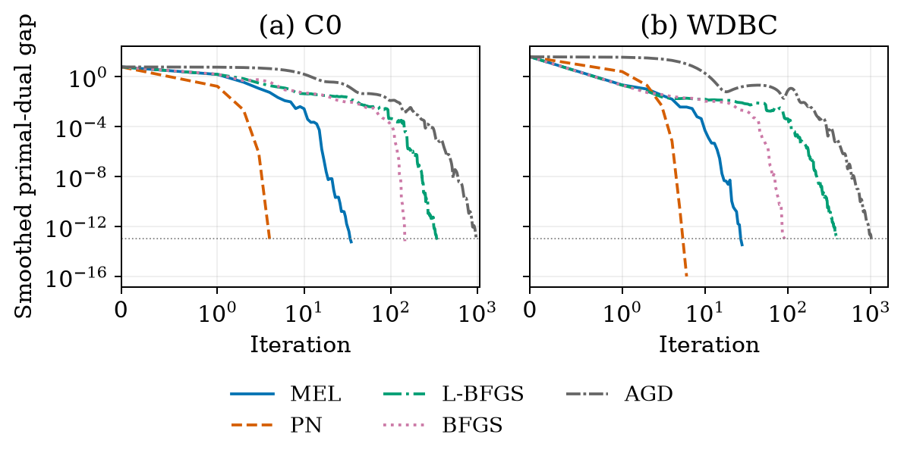
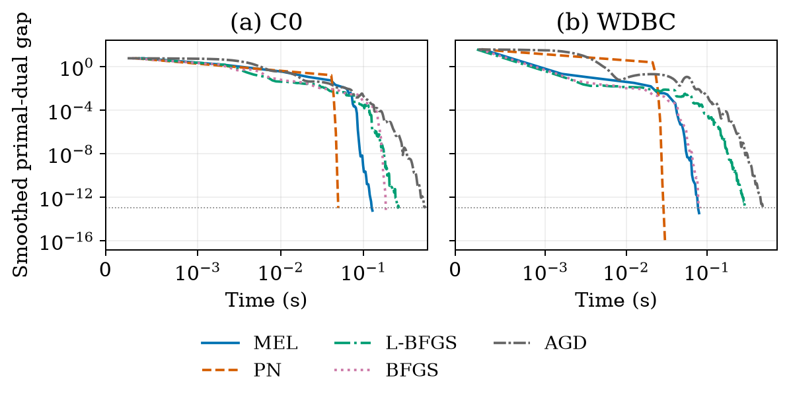
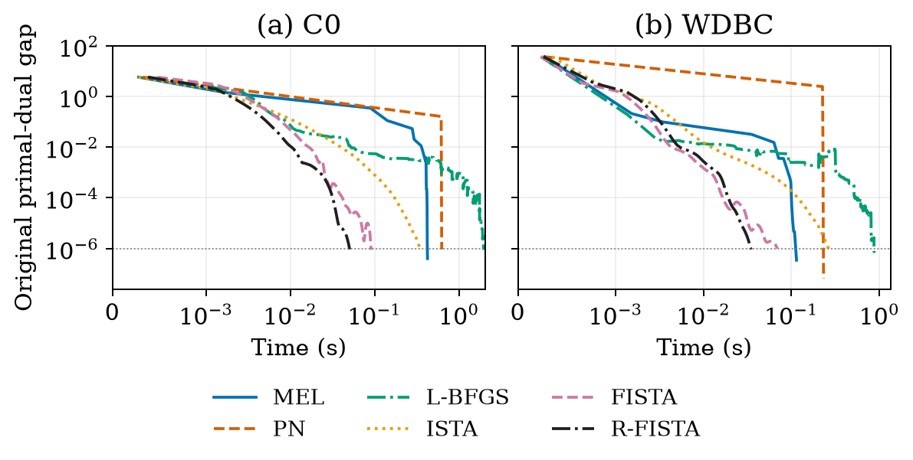
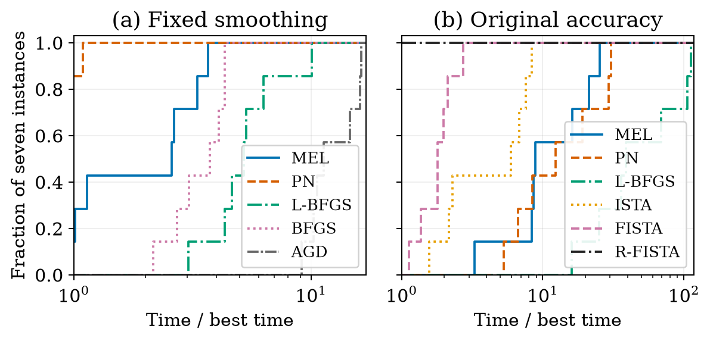

# MEL-BFGS experiments

[](LICENSE)
[](requirements.txt)

Reproducible experiments for a **nested Moreau-envelope L-BFGS method** with
semismooth Newton (SSN) subproblem solves. This repository accompanies the
MEL-BFGS manuscript and contains solver implementations, raw numerical records,
three current figure groups, four historical figure groups, multiple review campaigns, and supporting experiments.

[中文说明](README.zh-CN.md) · [Data](docs/DATA.md) · [Results](docs/RESULTS.zh-CN.md) · [Provenance](provenance/README.md)

## Latest study: version 2.1.0

The scale campaign now reaches **16,000 variables and 2,000 samples**, and adds
matrix-free proximal Newton, projected continuation, and a safeguard ablation.
There are **165 main records (156 successes, 9 failures)** and **12 successful
follow-up ablations**. All 177 returned points were independently checked at
the same original primal-dual tolerance.

P-CONT improves on CONT in 8/9 settings but is never the fastest main method.
R-FISTA has the lowest recorded median in seven settings; PQN leads two.
Matrix-free PN succeeds on every setting. Weak regularization exposes a
stage-rule cost that remains after removing the reference safeguard.

- [Run the expanded study](docs/SCALE_BENCHMARKS.md)
- [Complete scale results](docs/SCALE_RESULTS.md) and [safeguard ablation](docs/SCALE_ABLATION.md)
- [Theory progress and limitations](docs/PROJECTED_THEORY.md)
- [Raw main records and three figures](paper_results/scale_review), [ablation records](paper_results/scale_ablation)

The manuscript now proves a squared smoothing-parameter error bound for the
returned proximal point without a globally Lipschitz regularizer, and a
conservative total-work bound for a **separate safeguarded P-CONT variant**.
This is not an optimal complexity claim or a fixed-memory superlinear theorem.
The proof fragment is in [projected_continuation.tex](docs/projected_continuation.tex).
The original v1/v2 archives are retained; timing batches must not be pooled.

## Evidence update: version 2.0.0

The current campaign uses a common **original primal-dual gap** for every
method, including all continuation stages. It covers 64 settings and 192
measured runs: **171 succeed and 21 terminate without reaching the target**.
All terminal certificates were independently recomputed. Failed times are
consumed budgets, not solution times.

Continuation is faster than direct small-parameter MEL in 9 of the 10 cases
where both succeed in all repetitions. R-FISTA has the lowest recorded median
in all 11 main cases, but its difference from PQN on C0 is below 1% and their
ranges overlap. A scalar metric also beats L-BFGS on the n400 ablation.
These results do not support general computational superiority of MEL.

- [Current protocol and executable commands](docs/VALUE_BENCHMARKS.md)
- [All results and operation counts](docs/review/EXPERIMENT_RESULTS.md)
- [Theory audit](docs/review/THEORY_AUDIT.md) and [primary-source comparison](docs/review/LITERATURE.md)
- [Raw records, audit and three figures](paper_results/value_review)
- [Earlier 231-run reproduction audit](paper_results/reproduction_audit.json)

The two regularizers are the l1 penalty and a nonoverlapping group l2 penalty.
Dense PN comparisons stop at n=400; matrix-free PN and stochastic baselines
remain untested. Current PQN/PN implementations are representative deterministic
models, not the neighboring authors' software. See the protocol for limits.

## Method and scope

We minimize ridge-regularized sparse logistic regression:

$$F(x)=\frac1N\sum_{i=1}^N\log(1+\exp(-y_i a_i^\top x))+\frac{\tau}{2}\|x\|^2+\lambda\|x\|_1.$$

The method replaces the nonsmooth penalty by its Moreau envelope at a fixed
smoothing parameter. Each outer step builds a variable-metric quadratic model
of the smooth loss, retains the smoothed penalty, and solves this model by SSN.
A compact L-BFGS metric reduces the linear algebra cost.

Fixed smoothing generally leaves an error relative to the original problem.
The original-accuracy benchmark selects the smoothing parameter from the target
accuracy and tests a certificate for the original objective.

**Theory and evidence:** local outer superlinear convergence requires the
directional consistency and inexactness assumptions stated in the manuscript.
Fixed-memory L-BFGS alone does not guarantee those assumptions. Numerical
curves illustrate behavior on the selected instances; they do not prove a rate.

## Quick start

Use Python 3.12. The exact dependency versions used for the paper are pinned.

```bash
git clone https://github.com/seazen11/mel-bfgs-experiments.git
cd mel-bfgs-experiments
python -m venv .venv
```

Activate with `source .venv/bin/activate` on Linux/macOS or
`.venv\Scripts\Activate.ps1` in Windows PowerShell. Then:

```bash
python -m pip install -r requirements.txt
python reproduce.py verify
python reproduce.py smoke
python reproduce.py figures
```

`verify` uses only the Python standard library. It checks file integrity,
the 231 historical records, 192 first-review records, and 177 scale/ablation terminal records, summary consistency, and nested residual
criteria. `smoke` runs numerical checks and a small nested solve, then exercises
the four added baselines. Numerical commands download WDBC from UCI if absent
and verify its checksum. See [offline data instructions](docs/DATA.md).

## Reproduce the experiments

| Command | Output and purpose |
| --- | --- |
| `python reproduce.py figures` | Regenerate the four archived PDF/PNG figures from published traces |
| `python reproduce.py expanded` | Run all 77 settings: one warm-up and three measured repetitions each |
| `python reproduce.py supporting` | Run the initial suite, local diagnostics, bias tests, compact solves and ablations |
| `python reproduce.py all` | Run supporting and expanded suites |

Fresh output goes to `runs/latest/`. Use `--output runs/my-run` to keep another
run. The published files in `paper_results/` are kept separate. Timings depend
on hardware, library versions, system load, and implementation. Runtime
rankings need not match the paper on a different system.

## Comparison protocol

| Test | Algorithms | Stopping certificate |
| --- | --- | --- |
| Fixed smoothing, alpha = 0.01 | MEL, PN, direct L-BFGS, direct BFGS, AGD | Smoothed primal-dual gap <= 1e-13 |
| Original accuracy | MEL, PN, direct L-BFGS, ISTA, FISTA, R-FISTA | Original primal-dual gap <= 1e-6 |

For smoothed methods in the original-accuracy test,
`alpha = 1e-6 / (n * lambda**2)`. MEL uses memory 10; PN uses the exact Hessian
of the smooth loss with the same SSN subproblem solver. R-FISTA uses a
gradient-based adaptive restart. All methods start at zero. Measurements use
one BLAS thread and rotate method order across three repetitions.
Reported times include certificates, iteration recording, metric checks,
inner solves, and line searches; data preparation and file output are excluded.

The seven problems are six synthetic instances (600 x 80) and WDBC (569 x 30).
Set `tau = 0.02` and `lambda = 0.1 * ||A.T @ y / (2*N)||_inf`. Features are
standardized and no intercept is used. This is an optimization benchmark,
not a prediction study. Full update rules are in the source and manuscript.

## Main figures and results

All **231 measured runs reached their requested certificates**. The curves
below use C0 and WDBC, selected before the expanded measurements. Each trace
is an actual median-total-time run, with no averaging or fitting. A zero
floating-point gap is displayed at 1e-16. Horizontal axes are linear up to one
iteration or 1e-3 seconds, then logarithmic.

### 1. Fixed smoothing: iterations



### 2. Fixed smoothing: time



### 3. Original-problem accuracy



### 4. Performance profiles over all seven instances



MEL was faster than direct L-BFGS on all seven problems in both tests.
PN was fastest on six fixed-smoothing problems; MEL was fastest on one.
R-FISTA was fastest on every original-accuracy problem. These observations
support efficient nested solves, but do not establish universal superiority
over proximal gradient methods. Small timing differences are not claims of
statistical significance.

## Repository layout

```text
experiments/               Runnable numerical implementation and analysis
paper_results/expanded/    231 traces, summaries, metadata and vector figures
paper_results/supporting.zip  Earlier supporting batch (extract to inspect)
provenance/source/        Original source snapshots from the local study
docs/                     Data attribution and detailed result reports
reproduce.py              Portable reproduction and verification commands
SHA256SUMS.json            Release-file checksums
```

The supporting archive retains local-rate diagnostics, compact-versus-dense
linear solves, analytic smoothing bias, continuation and memory/inner-solver
ablations. It is a separate timing batch. Do not mix its times with the expanded
comparison. The detailed archived report describes that earlier batch.

## Citation and license

Use GitHub's **Cite this repository** entry or:

```bibtex
@misc{mel_bfgs_experiments,
  author = {{seazen11}},
  title = {{MEL-BFGS}: Reproducible Numerical Experiments},
  year = {2026},
  howpublished = {\url{https://github.com/seazen11/mel-bfgs-experiments}},
  note = {Version 2.1.0}
}
```

Project code, documentation and generated results are under the [MIT license](LICENSE).
WDBC retains its [UCI license and attribution](docs/DATA.md).
Report reproducibility issues through GitHub Issues with the command, Python
and dependency versions, and a minimal error log without personal paths.
