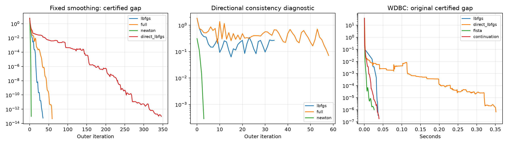
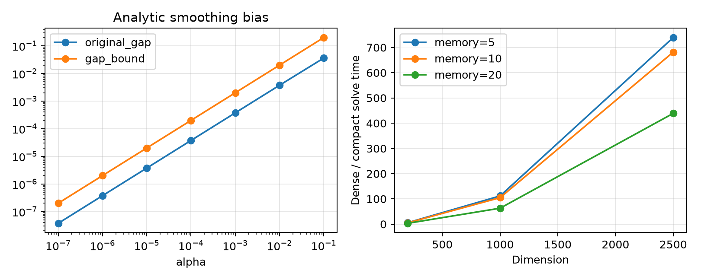

> 后续已完成扩展算法比较，论文主要曲线和时间表以[扩展对比实验报告](RESULTS.zh-CN.md)为准。本文保留原始批次及支撑实验记录。

# 嵌套 MEL-BFGS：本地实验报告

本报告记录实际运行结果。预期与观察分开陈述。此前其他算法生成的 GISETTE、ARCENE 等结果未参与本次比较。

## 1. 目标函数与数据

采用 $F(x)=N^{-1}\sum_{i=1}^N\log(1+\exp(-y_i a_i^Tx))+\frac{\tau}{2}\|x\|^2+\lambda\|x\|_1$，其中 $\tau=0.02$，$\lambda=0.1\|A^Ty/(2N)\|_\infty$。岭项归入 $f$。

因此 $f$ 是强凸、二阶连续可微函数，$L_f=\|A\|_2^2/(4N)+\tau$。正则项的 Moreau 包络为逐坐标 Huber 函数，梯度为 $\operatorname{clip}(x/\alpha,-\lambda,\lambda)$，广义 Hessian 为对角矩阵。这一结构满足内层强半光滑性，并使基矩阵求解成本为线性量级。$L_h=\lambda\sqrt n$。

- 合成数据：600 个样本、80 个变量；相关系数为 0 和 0.9；各使用随机种子 0、1、2，共 6 个问题。真实系数前 10 项非零，标签按逻辑模型抽样。
- 真实数据：[UCI WDBC](https://archive.ics.uci.edu/dataset/17/breast-cancer-wisconsin-diagnostic)，569 个样本、30 个变量，已下载到 `data/wdbc.data`。标签 M/B 映射为 +1/−1。
- 每列以全部样本的均值、标准差进行标准化，无截距。这里测量优化性能，不报告分类泛化能力，因此不设置训练／测试划分。
- WDBC 文件 SHA-256：`d606af411f3e5be8a317a5a8b652b425aaf0ff38ca683d5327ffff94c3695f4a`。

该问题适合检验论文的可分近端结构，但不能覆盖一般分析算子或昂贵近端映射。真实数据规模较小；大维度实验仅测试线性代数成本，不代表端到端大规模数据性能。

## 2. 实现与精度标准

外层使用 $B_k$ 近似 $\nabla^2f$，不是近似整个平滑目标的 Hessian。L-BFGS 保留 10 对曲率信息，以紧凑 Hessian 形式构造；谱界设为 $m_B=\tau/10$、$M_B=10L_f$，越界时重置。子问题采用 SSN、Woodbury 求解和 Armijo 回溯。外层、内层 Armijo 参数均为 $10^{-4}$，回缩比例为 $1/2$。

内层停止条件为 $\|R\|\le\eta_k\|s\|$，其中 $\eta_k=\min\{m_B/4,0.1\|\nabla\Phi_\alpha(x_k)\|\}$。内层最多 2000 步，外层最多 600 步；直接平滑 L-BFGS 和 FISTA 最多 15000 步。

对照包括：直接对平滑目标运行 SciPy L-BFGS-B（无边界约束、记忆 10）、嵌套完整 BFGS、嵌套精确 Hessian、原问题上的 FISTA，以及几何延拓。FISTA 使用原正则项的精确软阈值近端，不受平滑偏差影响。

固定平滑实验取 $\alpha=10^{-2}$，平滑原始—对偶间隙不超过 $10^{-13}$。同原问题精度实验统一要求原问题原始—对偶间隙不超过 $10^{-6}$，取最终 $\alpha=10^{-6}/(n\lambda^2)$。延拓从 0.1 起按 0.1 倍缩小到同一最终参数，每阶段控制平滑间隙不超过 $\alpha n\lambda^2/4$。

设 $p_i=\operatorname{sigmoid}(-y_i a_i^Tx)$，$v=A^T(-y\odot p)/N$，$u=\operatorname{clip}(-v/(1+\tau\alpha),-\lambda,\lambda)$。使用的对偶下界为

$$D_\alpha=-\frac1N\sum_i[p_i\log p_i+(1-p_i)\log(1-p_i)]-\frac{\|v+u\|^2}{2\tau}-\frac{\alpha}{2}\|u\|^2.$$

该式来自 logistic 损失、岭项和 $h_\alpha$ 的 Fenchel 共轭；$u$ 在盒约束内，因此对任意当前点均可行。$\Phi_\alpha(x)-D_\alpha$ 是平滑误差上界；令 $\alpha=0$ 即得到原问题的误差上界。原问题与平滑问题使用各自的对偶下界，不互相替代。

计算采用双精度和单 BLAS 线程。接近机器精度时 Armijo 检查允许约 $4	imes10^{-16}$ 的舍入裕量，内层残差存在 $2	imes10^{-13}$ 的绝对停止下限。以下审计检查该下限是否在主实验中破坏相对精度。这里的“证书”指双精度数值误差上界估计，不是区间算术证明。

- 梯度方向差分误差：5.941e-10；紧凑／稠密方向相对差：1.811e-16。
- 审计 777 个已返回外层方向，相对残差／容许残差的最大比值为 0.704；违规方向数为 0。
- 主实验 SSN 线性系统最大相对残差为 2.891e-14。

## 3. 固定平滑问题：收敛与速率

预期：低秩结构应减少 SSN 线性代数成本；精确 Hessian 的方向误差应趋于零；固定记忆 L-BFGS 不自动满足 Dennis–Moré 条件。

以下时间为预热一次后独立重复三次的中位数，单位秒。计时包含迭代中的证书计算、谱界检查、内层迭代和线搜索，不含数据预处理、参考解求解和结果写盘。Python 嵌套实现与 SciPy 编译实现的开销不同，故不作实现无关的复杂度结论。

| 问题 | 嵌套 L-BFGS（步／秒） | 精确 Hessian（步／秒） | 直接平滑 L-BFGS（步／秒） |
|---|---:|---:|---:|
| synthetic_rho0.0_seed0 | 9 / 0.0135 | 5 / 0.0140 | 166 / 0.0536 |
| synthetic_rho0.0_seed1 | 11 / 0.0173 | 4 / 0.0163 | 194 / 0.0545 |
| synthetic_rho0.0_seed2 | 9 / 0.0102 | 4 / 0.0119 | 163 / 0.0487 |
| synthetic_rho0.9_seed0 | 35 / 0.0508 | 4 / 0.0240 | 346 / 0.1016 |
| synthetic_rho0.9_seed1 | 56 / 0.0825 | 3 / 0.0201 | 394 / 0.1072 |
| synthetic_rho0.9_seed2 | 45 / 0.0663 | 4 / 0.0198 | 411 / 0.1301 |
| wdbc | 28 / 0.0706 | 6 / 0.0346 | 398 / 0.2638 |

所有固定平滑对照均达到了目标精度。嵌套 L-BFGS 相比直接平滑 L-BFGS 使用更少的外层步，在本次测量中更快。由于变量数只有 30 或 80，精确 Hessian 的成本较低，不能据此宣称拟牛顿优于 Newton。

局部速率诊断采用独立参考解，先用直接平滑 L-BFGS 求解，再用精确 Hessian 修正。参考解的梯度给出距离上界 $\|\nabla\Phi\|/\tau$。只讨论明显高于该误差和浮点误差的迭代区间。

| 问题 | 参考解距离上界 | L-BFGS 最后三个方向误差 | Newton 最后三个方向误差 |
|---|---:|---|---|
| synthetic_rho0.0_seed0 | 5.79e-14 | 4.08e-02, 2.29e-02, 4.62e-02 | 7.72e-03, 2.66e-04, 3.49e-07 |
| synthetic_rho0.0_seed1 | 3.40e-14 | 6.31e-02, 7.87e-02, 4.09e-02 | 3.87e-02, 4.24e-03, 6.73e-05 |
| synthetic_rho0.0_seed2 | 1.49e-14 | 5.04e-02, 3.73e-02, 5.01e-02 | 3.86e-02, 4.05e-03, 5.90e-05 |
| synthetic_rho0.9_seed0 | 1.26e-13 | 2.76e-01, 2.63e-01, 2.68e-01 | 1.11e-01, 1.45e-02, 2.86e-04 |
| synthetic_rho0.9_seed1 | 6.17e-14 | 2.47e-01, 3.71e-01, 5.60e-01 | 5.60e-02, 8.19e-03, 1.32e-04 |
| synthetic_rho0.9_seed2 | 1.26e-13 | 1.22e-01, 1.75e-01, 9.29e-02 | 9.05e-03, 1.69e-04, 5.01e-08 |
| wdbc | 4.66e-14 | 9.14e-02, 1.17e-01, 7.55e-02 | 2.92e-02, 1.11e-03, 1.76e-06 |

方向误差为 $\|(B_k-\nabla^2f(x_\alpha^*))s_k\|/\|s_k\|$。固定记忆方法的有限曲线不能证明该量渐近趋于零，也不能证明外层超线性定理的假设成立。精确 Hessian 对照提供满足方向一致性的可解释验证。

冻结子问题的 SSN 结果如下。正则项为分段二次包络，活跃结构稳定后可有限步到达数值解；此时不能对末尾零误差强行拟合二次收敛阶。

| 问题 | SSN 步数 | 最后三个残差 |
|---|---:|---|
| synthetic_rho0.0_seed0 | 10 | 2.35e-03, 1.00e-02, 6.22e-17 |
| synthetic_rho0.0_seed1 | 29 | 4.63e-03, 4.10e-03, 7.05e-17 |
| synthetic_rho0.0_seed2 | 10 | 2.17e-02, 1.39e-02, 6.91e-17 |
| synthetic_rho0.9_seed0 | 22 | 3.22e-02, 1.44e-02, 1.03e-16 |
| synthetic_rho0.9_seed1 | 25 | 1.70e-02, 1.02e-02, 8.08e-17 |
| synthetic_rho0.9_seed2 | 21 | 1.74e-03, 9.98e-03, 5.46e-17 |
| wdbc | 25 | 7.80e-02, 7.26e-02, 3.98e-16 |

进一步使用真实迭代误差比，而不是目标间隙比，检查局部速率。表中只保留相邻误差均大于参考解距离上界 20 倍的比值，列出最后三个可分辨值。

| 问题 | L-BFGS 相邻误差比 | Newton 相邻误差比 |
|---|---|---|
| synthetic_rho0.0_seed0 | 1.423e-01, 4.533e-02, 6.311e-02 | 3.606e-02, 1.309e-03, 1.714e-06 |
| synthetic_rho0.0_seed1 | 2.395e-01, 3.067e-01, 1.353e-01 | 1.199e-01, 1.575e-02, 2.542e-04 |
| synthetic_rho0.0_seed2 | 1.721e-01, 8.051e-02, 1.699e-01 | 1.158e-01, 1.454e-02, 2.154e-04 |
| synthetic_rho0.9_seed0 | 6.821e-01, 6.960e-01, 7.602e-01 | 1.224e-01, 1.801e-02, 3.464e-04 |
| synthetic_rho0.9_seed1 | 6.944e-01, 5.789e-01, 9.076e-01 | 6.460e-02, 1.261e-02, 1.852e-04 |
| synthetic_rho0.9_seed2 | 6.531e-01, 6.269e-01, 3.030e-01 | 6.664e-02, 1.492e-02, 2.603e-04 |
| wdbc | 4.698e-01, 6.323e-01, 9.332e-01 | 3.919e-02, 1.589e-03, 2.540e-06 |

Newton 对照的误差比下降与局部超线性结论相符；有限数据仍不构成渐近数学证明。L-BFGS 的比值需结合方向误差判断，不能由较少迭代次数代替速率条件。

图中的原始—对偶间隙上界可能不单调，因为对偶点也随迭代改变；SSN 残差也可能在活跃结构变化时上升。论文的 Armijo 单调性针对目标或模型值，不要求这些诊断量每一步都下降。

## 4. 原问题相同精度比较

预期：减小平滑参数会减小偏差，也会增加局部刚性。延拓可能改善初始化，但阶段开销可能抵消收益。所有方法均按原问题间隙停止。

| 问题 | 嵌套 L-BFGS 秒 | 直接平滑 L-BFGS 秒 | FISTA 秒 | 延拓秒（单次） |
|---|---:|---:|---:|---:|
| synthetic_rho0.0_seed0 | 0.0612 | 0.2788 | 0.0047 | 0.0235 |
| synthetic_rho0.0_seed1 | 0.0399 | 0.1801 | 0.0035 | 0.0238 |
| synthetic_rho0.0_seed2 | 0.0396 | 0.2226 | 0.0021 | 0.0211 |
| synthetic_rho0.9_seed0 | 0.1441 | 0.9710 | 0.0311 | 0.0644 |
| synthetic_rho0.9_seed1 | 0.1235 | 0.2660 | 0.0317 | 0.0479 |
| synthetic_rho0.9_seed2 | 0.1244 | 0.6985 | 0.0900 | 0.0463 |
| wdbc | 0.0913 | 0.7953 | 0.0638 | 0.0393 |

本次所有主实验均达到原问题 $10^{-6}$ 的间隙要求。延拓数据只有单次运行，不能据此作稳定的时间优势判断。FISTA 使用简单精确近端，在这些小规模可分问题上具有很强的竞争力。

初始实现将 SSN 上限设为 100 步，直接小参数求解曾触发内层上限；检查发现此时线性系统残差已接近机器精度，主要困难是回溯频繁。统一增加到 2000 步后主实验完成。该观察说明小平滑参数的全局阶段可能较慢，局部超线性结论不能保证从任意初始点快速进入局部区域。

## 5. 低秩求解成本与平滑误差

线性代数测试采用同一个正定 BFGS 矩阵和对角 Moreau 曲率，比对 Woodbury 求解与构造稠密矩阵后 Cholesky 求解。每配置预热一次、重复五次，报告中位数。矩阵和曲率对的公共构造不计时；稠密矩阵组装包含在稠密求解时间中。存储仅统计度量表示，不是程序峰值内存。

| 维度 | 记忆 | 紧凑毫秒 | 稠密毫秒 | 比值 | 方向相对差 |
|---:|---:|---:|---:|---:|---:|
| 200 | 5 | 0.196 | 1.143 | 5.8 | 2.36e-16 |
| 200 | 10 | 0.247 | 1.266 | 5.1 | 2.49e-16 |
| 200 | 20 | 0.255 | 0.853 | 3.4 | 2.44e-16 |
| 1000 | 5 | 0.442 | 49.354 | 111.8 | 2.53e-16 |
| 1000 | 10 | 0.424 | 44.508 | 105.0 | 2.84e-16 |
| 1000 | 20 | 0.715 | 45.175 | 63.2 | 2.79e-16 |
| 2500 | 5 | 0.552 | 408.221 | 739.4 | 3.47e-16 |
| 2500 | 10 | 0.565 | 385.361 | 681.7 | 3.45e-16 |
| 2500 | 20 | 1.050 | 460.786 | 439.0 | 3.45e-16 |

该结果支持“基矩阵可廉价求解时，低秩结构降低单次线性系统成本”。它不证明任意近端算子都具有这一优势，也不直接给出端到端加速比。

平滑偏差另用有闭式解的 $F(x)=\sum_i(a_ix_i^2/2-c_ix_i)+0.2\|x\|_1$ 验证，维度为 100，$a_i$ 在 $[0.3,2]$ 上等距取值。原解为 $x_i^*=\operatorname{sign}(c_i)(|c_i|-0.2)_+/a_i$。若 $|c_i|\le0.2(1+\alpha a_i)$，平滑解为 $c_i/(a_i+1/\alpha)$；否则等于原解。闭式解排除了优化误差的干扰。

| alpha | 实际原目标偏差 | 理论上界 | 解距离 |
|---:|---:|---:|---:|
| 1e-01 | 3.619e-02 | 2.000e-01 | 5.836e-02 |
| 1e-02 | 3.737e-03 | 2.000e-02 | 6.203e-03 |
| 1e-03 | 3.749e-04 | 2.000e-03 | 6.243e-04 |
| 1e-04 | 3.750e-05 | 2.000e-04 | 6.247e-05 |
| 1e-05 | 3.750e-06 | 2.000e-05 | 6.247e-06 |
| 1e-06 | 3.750e-07 | 2.000e-06 | 6.247e-07 |
| 1e-07 | 3.750e-08 | 2.000e-07 | 6.247e-08 |

实际偏差均在理论上界内，并随 alpha 减小而下降。该特殊对角问题的距离可能比一般上界更快下降，不能用其经验阶替换论文的一般距离界。

## 6. 消融、结论与下一步

| 记忆数 | 外层步数 | 秒（单次） | 状态 |
|---:|---:|---:|---|
| 3 | 48 | 0.1259 | converged |
| 5 | 38 | 0.0999 | converged |
| 10 | 35 | 0.1198 | converged |
| 20 | 28 | 0.1507 | converged |

- inner_ssn_ablation：converged；外层 6 步，耗时 0.0200 秒。

- inner_gradient_ablation：converged；外层 6 步，耗时 0.2152 秒。

内层梯度消融使用同一外层框架及相同的 2000 步内层上限。若返回 inner_failed，表示在这一预算内未满足残差要求，不能把它记作已收敛的速度比较。记忆规模的单次时间只作敏感性观察。

结果支持低秩线性求解的计算价值、SSN 对所选子问题的快速局部求解，以及平滑误差控制。结果不足以证明固定记忆 L-BFGS 普遍具有外层超线性收敛，也不足以证明该方法普遍优于 FISTA。数学结论由附录证明建立，数值实验只验证选定实例的行为。

后续建议：增加高维稀疏真实数据；加入具有块结构的 group-lasso；单独测量非对角近端导数的基求解成本；开展更多随机实例、较大维度端到端测试以及不同最终原问题精度的比较。新问题应先核验近端计算精度与假设，再作速度比较。

## 7. 复现

在项目根目录运行 `python reproduce.py supporting`。运行环境、依赖版本和数据校验值见 `results/manifest.json`。所有主实验的逐步残差、步长、迭代点与证书保存在 `results/*_fixed_*.json`、`results/*_original_*.json`。重复计时原始值见 `results/repeated_timings.json`；源代码为 `run_experiments.py` 和 `analyze_results.py`。

本报告的时间是本机测量值，系统负载和实现会影响结果。实验未使用统计显著性检验，不将单次或三次计时差异扩大为一般性能结论。
